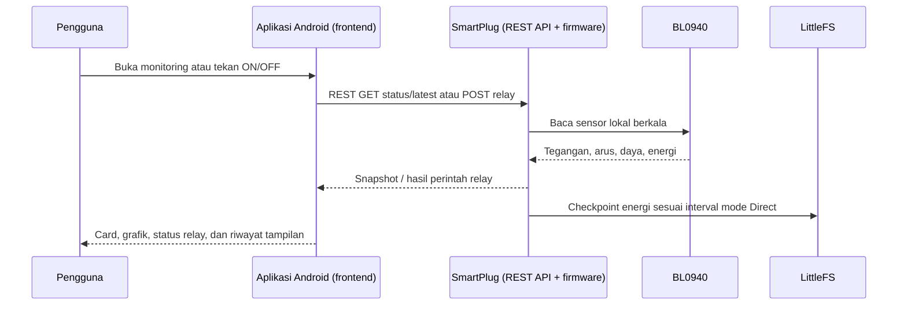
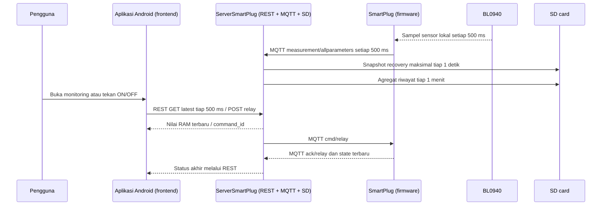
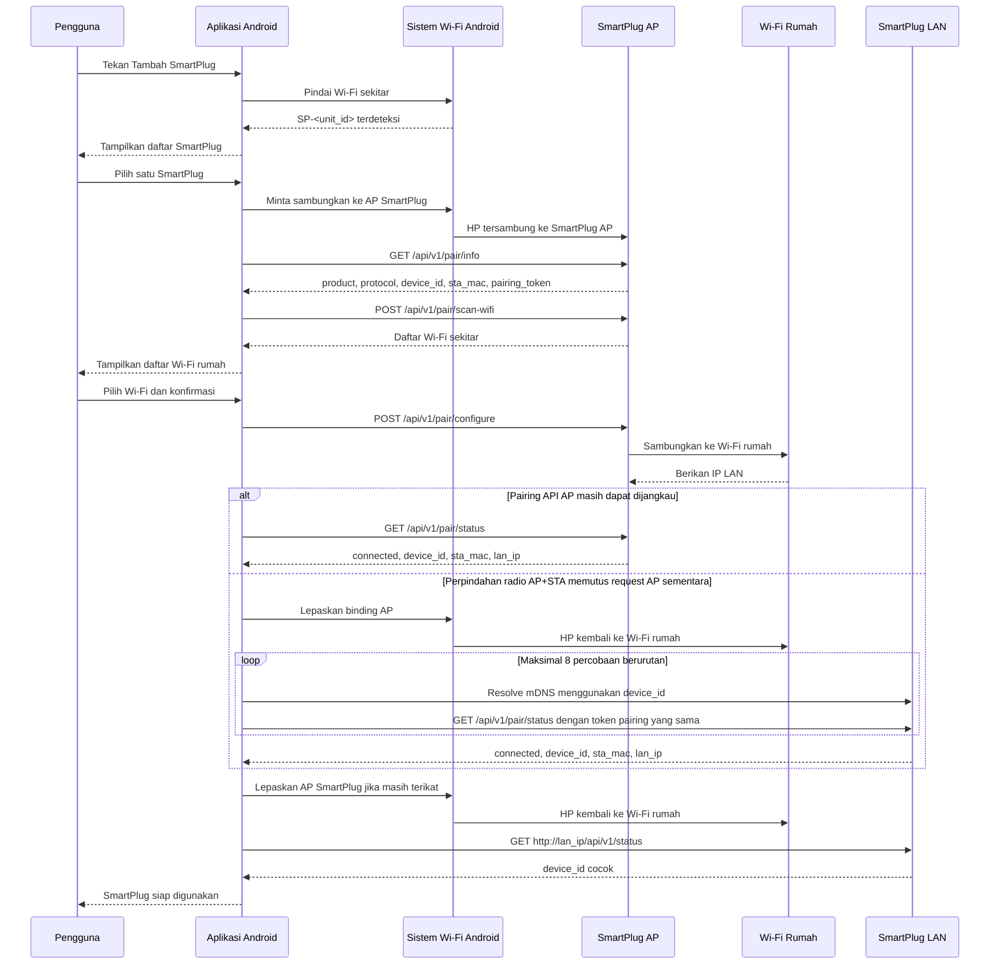
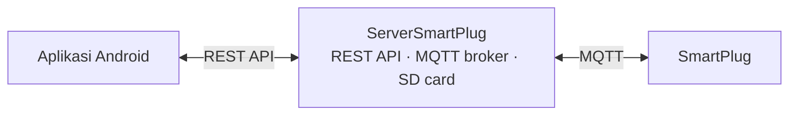
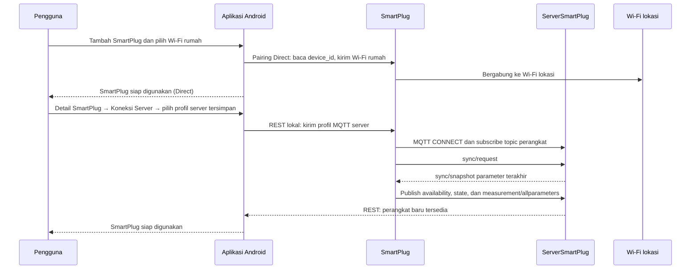

# SmartPlug integration design

## Wi-Fi Diagnostics SmartPlug (revisi source R3.10.11, belum di-upload)

Firmware menambahkan `GET /api/v1/diagnostics` dan halaman lokal
`http://192.168.4.1/diagnostics` tanpa mengubah onboarding, API aplikasi,
MQTT, timer, Schedule, owner key, atau algoritme kontrol relay. Keduanya
memerlukan session admin browser atau bearer **owner**; member tidak dapat
membaca diagnostik. Halaman hanya menampilkan data dan daftar event, tanpa
kontrol relay. Target refresh awal-ke-awal 1 detik; bila request lebih lama,
request berikutnya baru dimulai setelah respons selesai, tanpa overlap.

JSON diagnostik memuat versi firmware, device ID, uptime, `ESP.getResetReason()`,
free heap/max free block, AP dan STA, Direct/MQTT dan koneksi broker, relay dan
hasil command terakhir, interval half/full cycle zero crossing dalam us,
estimasi Hz, interval saat pulse sukses terakhir, serta status ZX
`valid`/`waiting`/`timeout`/`unavailable`. Kesehatan BL0940 menampilkan
reader state, usia sampel, jumlah paket baik/buruk. Status LittleFS, energi
tersimpan, dan checkpoint diagnostik juga tersedia.

Ring 24 event mencatat boot/reset reason, queue/wait/start/complete/fallback
relay, transisi Wi-Fi/MQTT, serta timer/Schedule. Tiap event disimpan di RTC
user memory tanpa write flash. Snapshot CRC di-checkpoint ke dua slot
LittleFS minimal berjarak 30 detik dan dipulihkan saat boot; putus daya total
dapat menghilangkan event sesudah checkpoint terakhir. Factory reset
menghapus ring. Pengamatan ini alat bantu bukti, bukan kesimpulan penyebab
restart dari source. Tidak boleh memakai USB-to-TTL biasa ketika P1 diberi
220 VAC; uji AC/relay harus dilakukan terpisah dengan fixture aman. Revisi
ini hanya dibuild, tidak di-upload dalam pekerjaan ini.

> **Status dokumen — 6 Oktober 2026.** Dokumen ini menjelaskan perilaku
> yang sudah ada pada source build `smartplug_product`, `server_esp32`, dan Android
> debug saat ini, kecuali bagian yang secara eksplisit diberi label *batasan*
> atau *belum terverifikasi fisik*. Build berhasil bukan bukti perangkat telah
> di-upload, terhubung ke Wi-Fi, menggerakkan relay, atau membaca meter secara
> benar di produk fisik.

## Ringkasan kondisi terkini

| Komponen | Kondisi source saat ini |
|---|---|
| Android | Onboarding AP Direct yang diproteksi, monitoring, grafik, riwayat, reset energi tiga konfirmasi, timer, Schedule, pemilih bahasa Indonesia/English, serta ringkasan Home telah diimplementasikan. `SmartPlugApp-v0.1.52.apk` (versionCode 53; SHA-256 `B4EBE3596D1B46E64CFDBB14A10B5D581180398C3A2A355EDA224872318DF669`) sudah dibangun dan dipasang pada Android 16. Timer memakai wheel deterministik `Jam`/`Menit`/`Detik` tanpa pemilih hari, dengan tepat satu nilai redup di atas, nilai aktif terpusat, dan satu nilai redup di bawah; total jam diubah internal menjadi `days + hours` hanya untuk kontrak firmware/server. Zero-duration Apply diblokir dan dialog timer hanya menutup setelah callback sukses. Cold refresh Home membaca perangkat persistensi sebelum menentukan status agar tidak mengunci tampilan offline karena Room belum mengemisi. Detail SmartPlug menyediakan “Tambah HP” untuk membuat kode enrolment member sekali pakai dan “Kelola HP” owner-only untuk melihat suffix ID anggota serta mencabut akses dengan konfirmasi; kredensial rahasia tidak dirender. Dalam mode Server, anggota tanpa token API ServerSmartPlug mengontrol melalui REST lokal SmartPlug dengan kredensial anggotanya sendiri; owner yang memiliki token ServerSmartPlug tetap memakai jalur server. Hasil relay terminal tidak disamarkan oleh refresh: `relay_command_result: zero_cross_timeout` diterjemahkan sebagai perintah ditolak. Pada monitor mode Server, aplikasi membaca satu snapshot `/latest` atomik sekitar tiap 500 ms saat layar detail terlihat, dengan batas panggilan monitoring 2 detik agar respons server yang tersendat tidak menahan UI terlalu lama; latensi Wi-Fi/Android tetap dapat menambah jarak antar respons. Scan Wi-Fi setup memiliki batas panggilan 20 detik dan handoff AP→LAN memakai retry terbatas serta menghentikan polling AP setelah hasil terminal/recovery LAN. Android 12+ backup/device-transfer dilarang eksplisit. |
| SmartPlug `smartplug_product_32k` | Pairing API, REST langsung, LittleFS counter energi, NTP, timer, Schedule harian, dan label Event telah diimplementasikan. R3.9.8 `SmartPlug-R3.9.8-automation-authority.bin` (SHA-256 `81335E457241049813126FD8126C87AAFCA536D32CC8130F0EEBF0A3B9931686`) telah di-upload pada COM7. Konfigurasi atau pemutusan MQTT hanya dapat dilakukan credential `owner` atau session admin; `member` tidak dapat mengubah server. Pada hand-off Direct↔MQTT, automation lokal dihapus deterministik tanpa menggerakkan relay. Automation lokal hanya berwenang pada Direct; endpoint timer/Schedule dan loop relay menolak automation lokal saat MQTT aktif dengan `409 automation_requires_direct_mode`. Saat timer Direct habis, source mempertahankan deadline sampai relay dilaporkan OFF, melakukan retry relay-OFF setiap satu detik maksimal tiga kali, dan memancarkan status terminal `timer_expiry_*`; bukti perangkat alur expiry/reboot tetap belum ada. Profile normal tetap memakai LittleFS 64 KB. Migrasi legacy memakai `smartplug_migrate_64_to_32_stage`, lalu profile final `smartplug_product_32k`; keduanya memakai metadata uploader NodeMCU namun linker/flash tetap dibatasi 512 KB. |
| ServerSmartPlug `server_esp32` | MQTT 3.1.1 broker berbasis library PicoMQTT, REST aplikasi, SD-card riwayat/energi, timer, dan Schedule harian tersimpan telah diimplementasikan. R3.8.17 `ServerSmartPlug-R3.8.17-offline-automation.bin` (SHA-256 `01EEAE922A5226E9254FFE4A102892DC878E11743F4248B5F71794F5E74A7C12`) telah di-upload pada COM6. `/health` pasca-boot membuktikan HTTP 200; web/MQTT/SD/waktu siap, satu perangkat aktif, 174 MQTT diterima/174 accepted/0 denied, satu `sync/request`/`sync/snapshot`, dan snapshot write 72 sukses/0 gagal dengan cadence terakhir 1104 ms. R3.8.17 mempertahankan deadline timer server ketika perangkat offline/stale tanpa menerbitkan perintah OFF atau mengonsumsi retry; setelah telemetry fresh kembali, retry bounded berjalan dan `expiry_failed` tetap terlihat jika tidak terselesaikan. Reset energi server menyimpan status `awaiting reset` secara durable lalu mengirim `sync/energy` legacy-compatible pada online/sync request sampai telemetry fisik mengonfirmasi energi ≤1 Wh. `automation/reset` membersihkan timer/Schedule milik server hanya untuk perangkat terkait dan tidak mengubah relay; `409 automation_command_pending` mencegah hand-off ketika command automation masih queued. R3.8.16 tetap mempertahankan state RAM live saat hot-remount sehingga state relay/timer stale pada SD tidak menimpa state live. `/health` memakai status snapshot runtime agar polling health tidak membuka SD card. |
| Validasi fisik | SmartPlug R3.9.8 pada COM7, Server R3.8.17 pada COM6, dan Android v0.1.52 pada Android 16 telah melalui build/upload atau install serta postboot smoke yang terbatas. Server live melaporkan SD siap, HTTP 200, satu perangkat, 174 accepted/0 denied, sync 1/1, dan snapshot write 72 sukses/0 gagal. Permintaan `GET /api/v1/health` SmartPlug tanpa credential menerima HTTP 401, konsisten dengan telemetry lokal yang tidak publik. Dua urutan onboarding bersih (server-first dan plug-first), telemetry signed, SD snapshot, dan Android Server monitoring sebelumnya telah dijalankan pada baseline teridentifikasi. Sandbox Android bukan bukti HP fisik kedua. Klaim timer Apply/Reset/expiry, matching OFF ACK, offline timer/reset recovery, multi-perangkat, recovery korupsi SD, **hot-remove/reinsert SD**, migrasi perangkat fisik, akurasi BL0940/kalibrasi, relay berbeban, kWh non-nol, power-loss ketika SD write, dan uji siklus panjang tetap belum dibuktikan. Lihat `MATURITY-GOAL-TRACKER.md` dan `RELEASE-EVIDENCE-MATRIX.md`. |

> **Kapasitas firmware ESP8266:** layout kompatibilitas perangkat aktif memakai
> LittleFS 64 KB, sedangkan artifact produk aktif memakai profile 32 KB final:
> `444,175 / 466,928 B` (95.1%). 32 KB
> cukup untuk dua record energi lokal. Perangkat 64 KB tidak boleh langsung
> menerima image 32 KB: stage image terlebih dahulu menyalin record energi ke
> handoff EEPROM ber-CRC, lalu image 32 KB memformat volume baru dan mengimpor
> record dengan verifikasi baca ulang. Detail operasional ada di
> [`firmware/MIGRATION-64K-TO-32K.md`](../firmware/MIGRATION-64K-TO-32K.md).

Schedule dan timer berjalan pada firmware/server, bukan pada proses aplikasi.
Karena itu keduanya tetap bekerja ketika aplikasi ditutup. Schedule merupakan
aturan harian pada jam `HH:mm` (24 jam), dengan maksimal delapan entry per
SmartPlug. Setiap entry berisi aksi `ON`/`OFF` dan label Event opsional.

### Otoritas automation dan kondisi offline

Satu perangkat hanya mempunyai satu authority automation aktif. Pada mode
**Direct**, SmartPlug menyimpan dan menjalankan timer/Schedule lokal dari
LittleFS. Pada mode **Server/MQTT**, ServerSmartPlug menyimpan dan menjalankan
timer/Schedule di SD card; SmartPlug menolak mutation timer/Schedule lokal dan
loop relay mengabaikan record Direct lama. Hanya owner atau session admin yang
dapat mengubah koneksi server; credential member tetap dapat membaca dan
mengontrol operasi biasa sesuai haknya, tetapi tidak dapat memindah authority.

Saat SmartPlug offline/stale, ServerSmartPlug tidak mengirim relay OFF untuk
timer yang sudah jatuh tempo dan tidak menghabiskan jatah retry. Deadline
dipertahankan secara durable, lalu diproses ulang setelah telemetry fresh
kembali. Demikian pula reset energi server disimpan sebagai `awaiting reset`;
pesan reset diulang pada online atau `sync/request` hingga telemetry fisik
mengonfirmasi energi `≤ 1 Wh`. Ini adalah perilaku source/build dan smoke
postboot—bukan bukti fault/recovery fisik penuh.

## Perbandingan frontend dan backend

Tampilan Android tidak perlu menampilkan istilah REST atau MQTT kepada pengguna.
Perbedaan berikut menjelaskan jalur yang bekerja di belakang layar setelah
perangkat selesai ditambahkan.

| Aspek | Tanpa server — Direct | Dengan ServerSmartPlug — Server |
|---|---|---|
| Tujuan frontend | Aplikasi membuka IP LAN SmartPlug yang dipilih. | Aplikasi membuka satu IP LAN ServerSmartPlug. |
| Monitoring detail | Aplikasi meminta snapshot pengukuran ke SmartPlug melalui REST. | Aplikasi meminta `/latest` ke server tiap 500 ms; server memberi snapshot MQTT terakhir dari RAM. |
| Kontrol relay | Aplikasi mengirim REST langsung ke SmartPlug. | Aplikasi mengirim REST ke server; server meneruskan perintah lewat MQTT ke SmartPlug. |
| Data sensor | SmartPlug membaca BL0940 dan menjawab data lokal terakhir. | SmartPlug membaca BL0940 dan publish MQTT tiap 500 ms ke server. |
| Energi dan riwayat | Counter dipulihkan dari LittleFS; riwayat tampilan bergantung mode aplikasi. | Server menyimpan snapshot recovery SD tiap maksimal 1 detik dan riwayat agregat tiap 1 menit. |
| Saat aplikasi ditutup | Firmware SmartPlug tetap menjalankan timer/Schedule lokal. | ServerSmartPlug menjadi satu-satunya authority timer/Schedule; firmware SmartPlug menolak dan tidak mengeksekusi automation lokal saat MQTT aktif. |
| Ketergantungan jaringan | HP harus dapat menjangkau IP masing-masing SmartPlug. | HP hanya perlu menjangkau server; SmartPlug harus dapat menjangkau server MQTT. |

### Alur frontend/backend tanpa server



Frontend hanya memegang UI, daftar perangkat, serta request REST. Backend di
mode ini berada di SmartPlug sendiri: firmware membaca sensor, menjaga counter
energi, menjalankan relay/timer/Schedule, dan menyediakan REST API lokal.

### Alur frontend/backend dengan server



Pada mode server, backend utama aplikasi adalah ServerSmartPlug. Server
memisahkan data live di RAM dari penyimpanan SD: monitoring dapat mengikuti
telemetry 500 ms tanpa membuat SD card ditulis 500 ms. Saat SmartPlug boot,
firmware meminta `sync/snapshot`; server mengembalikan snapshot terakhir untuk
recovery energi tanpa menjadikan state relay lama sebagai perintah relay.

## Outline

1. [Perbandingan frontend dan backend](#perbandingan-frontend-dan-backend)
2. [Mode tanpa server (REST langsung)](#mode-tanpa-server-rest-langsung)
   - [Tujuan](#tujuan)
   - [Varian fisik](#varian-fisik)
   - [Hasil onboarding](#hasil-onboarding)
   - [Pengalaman pengguna](#pengalaman-pengguna)
   - [Standar nama discovery](#standar-nama-discovery)
   - [Alur sistem](#alur-sistem)
   - [Keadaan perangkat](#keadaan-perangkat)
   - [Pairing API](#pairing-api)
   - [Password Wi-Fi rumah](#password-wi-fi-rumah)
   - [Perpindahan HP dari AP ke Wi-Fi rumah](#perpindahan-hp-dari-ap-ke-wi-fi-rumah)
   - [REST operasional](#rest-operasional)
   - [Penyimpanan energi lokal](#penyimpanan-energi-lokal)
   - [Kontrak REST API](#kontrak-rest-api)
   - [Status relay](#status-relay)
   - [Kompatibilitas versi](#kompatibilitas-versi)
   - [Interval pembacaan pengukuran](#interval-pembacaan-pengukuran)
   - [Jika IP berubah](#jika-ip-berubah)
   - [Siklus access point dan pairing](#siklus-access-point-dan-pairing)
   - [Status implementasi firmware](#status-implementasi-firmware)
   - [Pengujian akhir](#pengujian-akhir)
   - [Kriteria selesai](#kriteria-selesai)
   - [Persyaratan aplikasi Android](#persyaratan-aplikasi-android)
3. [Mode dengan server (MQTT)](#mode-dengan-server-mqtt)
   - [Tujuan](#tujuan-1)
   - [Arsitektur](#arsitektur)
   - [Konfigurasi awal server](#konfigurasi-awal-server)
   - [Pilihan ServerSmartPlug pada pairing](#pilihan-serversmartplug-pada-pairing)
   - [Alur menambahkan SmartPlug ke server](#alur-menambahkan-smartplug-ke-server)
   - [Kontrak MQTT SmartPlug dan server](#kontrak-mqtt-smartplug-dan-server)
   - [Sinkronisasi energi](#sinkronisasi-energi)
   - [REST API aplikasi ke server](#rest-api-aplikasi-ke-server)
   - [Status koneksi dan data](#status-koneksi-dan-data)
   - [Interval baca aplikasi](#interval-baca-aplikasi)
   - [Retensi riwayat dan kapasitas](#retensi-riwayat-dan-kapasitas)
   - [Kondisi keberhasilan mode dengan server](#kondisi-keberhasilan-mode-dengan-server)
   - [Status implementasi](#status-implementasi)

## Mode tanpa server (REST langsung)

### Tujuan

Dokumen ini menetapkan alur SmartPlug baru: aplikasi Android mencari AP
SmartPlug, pengguna memilih perangkat dan Wi-Fi rumah, lalu aplikasi memakai
REST API melalui LAN.

Bab ini menjelaskan jalur aplikasi yang berkomunikasi langsung dengan
SmartPlug setelah onboarding. Istilah protokol integrasi tidak ditampilkan pada
layar pengguna.

### Varian fisik

Dokumen ini berlaku untuk MultiPlug dan SinglePlug. Keduanya memakai firmware,
rangkaian, pengukuran, kontrol relay latching, API, MQTT, dan algoritma energi
yang sama.

| Varian | Perbedaan |
|---|---|
| MultiPlug | Bentuk fisik untuk penggunaan banyak beban. |
| SinglePlug | Bentuk fisik untuk penggunaan satu beban. |

Aplikasi memakai nama umum SmartPlug; pengguna dapat memberi `display_name`
sesuai lokasi atau penggunaan. Semua aturan komunikasi memakai `device_id`
yang sama, yaitu `SP-` diikuti STA MAC tanpa tanda titik dua.

### Hasil onboarding

| Data aplikasi | Fungsi |
|---|---|
| `device_id` | Identitas permanen perangkat, dibentuk dari STA MAC. |
| `sta_mac` | MAC Wi-Fi perangkat untuk pemeriksaan identitas dan discovery. |
| `lan_ip` | IP LAN terakhir dari router. Bisa berubah. |
| `display_name` | Nama yang diberikan pengguna. |
| `integration_mode` | `rest` pada alur ini. |

`device_id` adalah identitas utama. `lan_ip` hanya alamat terakhir.

### Pengalaman pengguna

1. Buka aplikasi dan baca informasi pengenalan produk.
2. Tekan **Lanjut**, lalu pilih **Tambah SmartPlug**.
3. Pilih SmartPlug yang tampil pada daftar perangkat sekitar.
4. Pilih Wi-Fi rumah dari daftar.
5. Masukkan password Wi-Fi rumah bila aplikasi belum memilikinya.
6. Tekan **Hubungkan** dan tunggu sampai perangkat siap digunakan dalam mode
   **Direct**.
7. Bila ingin memakai server, daftarkan ServerSmartPlug secara terpisah dari
   menu **Tambah Perangkat**, lalu buka detail SmartPlug → **Koneksi Server**.

### Standar nama discovery

| Komponen | Nama yang diumumkan | Dipakai untuk |
|---|---|---|
| Access point SmartPlug | `SP-<unit_id>` | Daftar SmartPlug di aplikasi. |
| Access point ServerSmartPlug | `ServerSmartPlug-Setup` | Menemukan dan menyiapkan ServerSmartPlug dari aplikasi. |
| Host broker server | `srvrplug-<server_sta_mac>.local` | Alamat MQTT/mDNS server; contoh `srvrplug-1cc3ab3cc61c.local`. |

`unit_id` adalah delapan karakter Base32 huruf besar tanpa karakter ambigu
`0`, `1`, `I`, dan `O`, dibangkitkan secara acak pada first boot pabrik lalu
disimpan permanen di EEPROM. Contoh: `7K2M9QX4`. Nilai ini tidak dibentuk dari
urutan produksi maupun bagian MAC address.

`server_id` juga harus unik pada setiap unit server. Aplikasi memfilter SSID
yang dimulai dengan `SP-`, lalu menyimpan `device_id` SmartPlug dan `server_id`
ServerSmartPlug sebagai identitas tetap.

Aplikasi juga menyimpan `unit_id` dari AP yang berhasil di-pairing bersama data
perangkat yang sudah terdaftar. Pada pemindaian **Tambah SmartPlug** berikutnya,
AP dengan `unit_id` yang sudah terdaftar disembunyikan dari daftar — mencegah
perangkat yang sama muncul lagi hanya karena AP-nya masih terdeteksi (mis. unit
belum keluar dari mode AP+STA, atau berada dalam jangkauan Wi-Fi setelah reset).

Password AP dibentuk otomatis dari `unit_id`, sehingga aplikasi dapat
menghitungnya dari SSID sebelum meminta Android menyambung:

```text
SSID     = SP-<unit_id>
Password = setup-<unit_id>
```

### Alur sistem



AP setup tetap dipancarkan selama provisioning. Namun pada ESP8266, perpindahan
channel ketika radio berubah dari AP ke AP+STA dapat membuat request HTTP lewat
AP gagal sementara, meskipun SmartPlug sudah masuk Wi-Fi rumah. Karena itu
aplikasi tidak langsung menganggap pairing gagal: aplikasi melepas binding AP,
menunggu Wi-Fi rumah aktif, lalu mencoba hingga delapan kali secara berurutan
untuk mencari `device_id` melalui mDNS dan melanjutkan `pair/status` ke IP LAN
menggunakan `pairing_token` dan `configuration_id` yang sama. Percobaan ini
dibatasi agar kegagalan benar-benar ditampilkan, bukan menunggu tanpa akhir.
Hasil pairing tetap diverifikasi lagi melalui endpoint status LAN.

### Keadaan perangkat

| Keadaan | AP setup | Wi-Fi rumah | Arti aplikasi |
|---|---|---|---|
| `unprovisioned` | Aktif | Belum diatur | Tampilkan pada halaman Tambah SmartPlug. |
| `pairing` | Aktif | Belum/masih mencoba | Aplikasi dapat menjalankan pairing API. |
| `connecting` | Aktif | Sedang bergabung | Tampilkan progres; jangan kirim konfigurasi kedua. |
| `connected` | Aktif | Tersambung | Ambil `lan_ip`, lalu kembali ke Wi-Fi rumah. |
| `failed` | Aktif | Gagal | Tampilkan alasan aman dan kembali memilih Wi-Fi. |

### Pairing API

Endpoint pairing hanya tersedia melalui AP setup di `http://192.168.4.1`.
Aplikasi mengikat request HTTP ke jaringan AP SmartPlug yang dipilih Android.

#### Membaca identitas

```text
GET /api/v1/pair/info
```

```json
{
  "api_version": "1.0",
  "product": "smartplug",
  "protocol": "pairing-v1",
  "device_id": "SP-A1B2C3D4E5F6",
  "sta_mac": "A1:B2:C3:D4:E5:F6",
  "state": "unprovisioned",
  "pairing_token": "temporary-token",
  "token_expires_in_s": 300
}
```

Lanjutkan hanya bila `product=smartplug` dan `protocol=pairing-v1`.
`pairing_token` disimpan di memori aplikasi dan berlaku lima menit.

#### Memindai Wi-Fi rumah

```text
POST /api/v1/pair/scan-wifi
X-Pairing-Token: temporary-token
```

```json
{
  "api_version": "1.0",
  "state": "pairing",
  "networks": [
    {"ssid": "WiFi-Rumah", "rssi": -48, "security": "wpa2"},
    {"ssid": "WiFi-Tamu", "rssi": -68, "security": "open"}
  ]
}
```

SmartPlug yang memindai Wi-Fi, bukan aplikasi. AP yang diawali `SP-` atau
`ServerSmartPlug-Setup` tidak ditampilkan sebagai pilihan Wi-Fi rumah.

#### Mengirim konfigurasi

```text
POST /api/v1/pair/configure
X-Pairing-Token: temporary-token
Content-Type: application/json
```

```json
{
  "ssid": "WiFi-Rumah",
  "password": "password-wifi-rumah",
  "connection_profile": {
    "type": "direct"
  }
}
```

Untuk koneksi melalui server, aplikasi memakai profile berikut sebagai bagian
dari request yang sama:

```json
{
  "ssid": "WiFi-Rumah",
  "password": "password-wifi-rumah",
  "connection_profile": {
    "type": "server",
    "server_id": "SRV-01A2B3C4D5E6",
    "broker_host": "srvrplug-01a2b3c4d5e6.local",
    "broker_port": 1883,
    "mqtt_username": "SmartPlug",
    "mqtt_password": "<mqtt_password_terdaftar>",
    "base_topic": "smartplug/SP-84F3EB123456"
  }
}
```

Respons awal adalah `{"api_version":"1.0","configuration_id":"cfg-...","state":"connecting"}`.
Password Wi-Fi maupun broker tidak boleh masuk ke URL, log aplikasi, atau
layar ringkasan.

#### Menunggu hasil

```text
GET /api/v1/pair/status?configuration_id=cfg-...
X-Pairing-Token: temporary-token
```

Contoh respons berhasil:

```json
{
  "api_version": "1.0",
  "state": "connected",
  "ssid": "WiFi-Rumah",
  "device_id": "SP-A1B2C3D4E5F6",
  "sta_mac": "A1:B2:C3:D4:E5:F6",
  "lan_ip": "192.168.1.25",
  "owner_token": "one-time-owner-token"
}
```

`owner_token` hanya dikirim satu kali pada respons `connected`. Aplikasi
menyimpannya pada Android Keystore dan mengirimkannya pada setiap REST API
operasional melalui `Authorization: Bearer <owner_token>`. Factory reset
menghapus token ini; pairing berikutnya membuat token baru.

Contoh respons gagal:

```json
{"api_version":"1.0","state":"failed","reason":"authentication_failed"}
```

Polling dijalankan berurutan, satu request aktif, tiap satu detik sampai
`connected` atau `failed`.

| `reason` saat gagal | Arti untuk aplikasi |
|---|---|
| `pairing_closed` | Minta pengguna menjalankan factory reset. |
| `invalid_pairing_token` | Hentikan pairing dan mulai kembali dari pemilihan SmartPlug. |
| `wifi_not_found` | Tampilkan daftar Wi-Fi lagi. |
| `wifi_authentication_failed` | Minta password Wi-Fi diperiksa. |
| `wifi_connection_timeout` | Tawarkan ulangi konfigurasi. |
| `server_profile_invalid` | Hentikan proses dan periksa ServerSmartPlug. |
| `broker_connection_failed` | Wi-Fi berhasil, tetapi server belum dapat dihubungi. |

### Password Wi-Fi rumah

Android tidak memberikan password Wi-Fi sistem kepada aplikasi biasa. Aplikasi
hanya dapat memakai password yang sebelumnya dimasukkan pengguna dan disimpan
oleh aplikasi sendiri secara terlindungi. Jika belum ada, tampilkan kolom
password setelah pengguna memilih SSID.

Password dipakai untuk request pairing lalu dibuang setelah SmartPlug memberi
status `connected`. Password tidak tampil pada halaman utama aplikasi.

### Perpindahan HP dari AP ke Wi-Fi rumah

1. Selama setup, request HTTP aplikasi terikat ke koneksi AP SmartPlug.
2. Setelah menerima `connected` dan `lan_ip`, aplikasi melepas koneksi AP.
3. Sistem Android mengembalikan HP ke Wi-Fi rumah.
4. Aplikasi menunggu Wi-Fi rumah aktif.
5. Aplikasi meminta `GET http://lan_ip/api/v1/status`.
6. Onboarding selesai hanya bila `device_id` REST LAN sama dengan `device_id`
   yang didapat ketika masih terhubung ke AP.

Android dapat menampilkan dialog persetujuan koneksi. Aplikasi tidak mencoba
melewati dialog tersebut.

### REST operasional

| Tujuan | Endpoint |
|---|---|
| Verifikasi identitas/jaringan | `GET /api/v1/status` |
| Baca pengukuran lengkap | `GET /api/v1/measurements/allparameters` |
| Baca parameter tertentu | `GET /api/v1/measurements/voltage`, `current`, `active-power`, `apparent-power`, `power-factor`, atau `energy` |
| Kontrol relay | `POST /api/v1/relay` |
| Timer perangkat | `GET`/`POST /api/v1/timer` |
| Schedule harian | `GET`/`POST /api/v1/schedule` |
| Reset counter energi | `POST /api/v1/energy/reset` dengan tiga `RESET_ENERGY` |
| Factory reset | `POST /api/v1/factory-reset` dengan tiga `FACTORY_RESET` |

Aplikasi mengirim `Authorization: Bearer <owner_token>` pada seluruh endpoint
operasional. Aplikasi memeriksa `has_sample` dan `fresh` sebelum menampilkan pengukuran
sebagai data terkini. HTTP 202 pada relay berarti perintah diantrikan; aplikasi
tetap membaca status relay terbaru sebelum menyatakan proses selesai.

`POST /api/v1/timer` menerima `days`, `hours`, `minutes`, `seconds`, atau
`action=reset`. Jika timer disetel ketika relay OFF, hitung mundur baru dimulai
saat relay ON. `POST /api/v1/schedule` menerima salah satu aksi berikut:
`set_enabled`, `add`, `delete`, atau `move`. Aksi `add` menerima `hour`,
`minute`, `state` (`on`/`off`), dan `event` opsional. Nilai event dibatasi
24 karakter ASCII yang aman untuk kontrak REST/penyimpanan; koma, titik dua,
tanda kutip, dan backslash ditolak.

### Penyimpanan energi lokal

SmartPlug selalu menghitung `energy_wh` sendiri dari pembacaan meter. Counter
aktif berada di RAM dan pemulihannya selalu aktif melalui LittleFS sebagai dua
record bergantian dengan CRC. Tidak ada toggle penyimpanan energi dan tidak ada
state persistensi energi di EEPROM.

LittleFS tidak dipakai untuk riwayat grafik. Mode REST langsung membuat
checkpoint setiap **15 menit** untuk mengurangi keausan flash; listrik padam
dapat menyebabkan maksimum 15 menit energi terbaru belum dipulihkan. Mode
MQTT membuat checkpoint setiap **5 menit**. Pada boot mode MQTT, LittleFS
dibaca sebagai **cadangan**, bukan sumber utama: SmartPlug meminta snapshot
server terlebih dahulu dan hanya memakai checkpoint LittleFS bila server tidak
terjangkau atau tidak membalas dalam batas waktu pemulihan. Factory reset
menghapus seluruh checkpoint energi LittleFS; setelah restart mode MQTT
memulihkan counter dari server bila snapshot tersedia, sedangkan mode REST
langsung memulai counter baru.

`GET /api/v1/status` juga mengirim `energy_persistence` dengan kondisi
LittleFS, nilai checkpoint terakhir (`saved_wh`), dan
`next_save_seconds`. Aplikasi memakai data itu pada card Energy untuk
menampilkan kWh yang benar-benar telah tersimpan dan countdown menuju
checkpoint berikutnya. Counter yang sedang tampil tetap bersifat realtime;
`saved_wh` bukan nilai pembacaan saat ini.

Reset energi yang lolos tiga konfirmasi menulis checkpoint `0` secara eksplisit
ke LittleFS. Ini merupakan pengecualian terkontrol terhadap aturan normal yang
menolak counter energi turun, sehingga nilai lama tidak dipulihkan kembali
setelah reboot.

### Kontrak REST API

Semua respons JSON memakai `api_version: "1.0"`. Respons gagal selalu
berbentuk berikut agar aplikasi tidak perlu menafsirkan pesan bebas:

```json
{
  "api_version": "1.0",
  "error": {
    "code": "invalid_owner_token",
    "message": "Authorization token is invalid or expired"
  }
}
```

| Endpoint | Sukses | Gagal yang dibakukan |
|---|---:|---|
| `GET /api/v1/status` | 200 | 401 `invalid_owner_token` |
| `GET /api/v1/measurements/allparameters` | 200 | 401 `invalid_owner_token`, 503 `measurement_unavailable` |
| `GET /api/v1/measurements/<parameter>` | 200 | 400 `invalid_parameter`, 401 `invalid_owner_token`, 503 `measurement_unavailable` |
| `POST /api/v1/relay` | 202 | 400 `invalid_relay_state`, 401 `invalid_owner_token`, 409 `relay_busy` |
| `POST /api/v1/pair/configure` | 202 | 400 `invalid_configuration`, 401 `invalid_pairing_token`, 409 `pairing_closed` |
| `GET /api/v1/pair/status` | 200 | 401 `invalid_pairing_token`, 404 `configuration_not_found` |

`POST /api/v1/relay` hanya menerima payload berikut:

```json
{"state":"on"}
```

atau:

```json
{"state":"off"}
```

Respons `202` wajib memuat `api_version`, `command_id`, `state`, dan
`status: "queued"`. Status perangkat wajib memuat `api_version`, `device_id`,
`relay_state`, `has_sample`, `fresh`, dan `sample_age_ms`.

### Status relay

Firmware menyimpan `relay_state` sebagai status logis terakhir. Perintah ON atau
OFF mengubah keluaran hanya bila state tujuan berbeda dari `relay_state`. Jeda
minimum antarpergantian adalah satu detik pada relay latching. Setelah
perubahan selesai, firmware memperbarui `relay_state`, lalu menerbitkan state
tersebut pada REST dan MQTT. Aplikasi menganggap command selesai hanya setelah
state baru itu diterima.

#### Pemulihan state saat listrik kembali (implementasi R3.10.x, belum terverifikasi pada hardware)

Aturan lama "arus di atas `0.02 A` menetapkan state saat boot" dan "selalu ON saat
boot" **tidak berlaku lagi**. Firmware tidak tahu berapa lama listrik mati
(tidak ada RTC baterai) dan tidak membuat aturan berbasis durasi mati.

- **Mode Direct.** Setiap state relay yang sudah stabil 1,5 detik disimpan ke
  LittleFS pada dua slot bergantian (`/relay-a.dat`, `/relay-b.dat`) dengan CRC32,
  memakai pola yang sama dengan persistensi energi; tulisan yang terputus saat
  listrik mati hanya merusak slot yang sedang ditulis. Saat boot firmware
  membaca state terakhir dan, bila ON, menyalakan relay **sekali** setelah jeda
  3 detik. Record hilang atau korup berarti OFF (fail-safe). Pada build SSR,
  keluaran sudah OFF setelah boot sehingga state OFF tidak memicu apa pun; pada
  relay latching, state OFF yang tersimpan menghasilkan satu pulsa OFF. Perubahan
  state sebelum keputusan restore tidak boleh menimpa record, dan penulisan yang
  gagal dicoba ulang paling cepat tiap 30 detik. Pemulihan hanya berjalan pada
  build yang mengizinkan aktuasi relay (`SMARTPLUG_ALLOW_RELAY_ACTUATION`).
  Logika keputusan ada di `firmware/include/SmartPlugPowerRestore.h` dan diuji di
  host.
- **Mode Server.** SmartPlug tidak memulihkan sendiri dan tidak memakai
  `relay_state` snapshot server untuk menjalankan relay. Rekonsiliasi dilakukan
  server (lihat "Rekonsiliasi relay setelah SmartPlug boot ulang").
- Tidak ada pengaturan kebijakan off/last/on di aplikasi pada versi ini.

### Kompatibilitas versi

Versi kontrak saat ini adalah `api_version: "1.0"`. Aplikasi, SmartPlug, dan
ServerSmartPlug harus memakai versi mayor yang sama. Aplikasi hanya melanjutkan
pairing, monitoring, atau kontrol bila menerima major version `1`; bila tidak,
aplikasi menghentikan operasi dan meminta pembaruan komponen yang tidak cocok.

### Interval pembacaan pengukuran

SmartPlug memperbarui snapshot pengukuran setiap **500 ms**. Endpoint REST
mengembalikan snapshot terakhir; satu request tidak memicu pembacaan sensor
baru. Aplikasi menggunakan `/api/v1/measurements/allparameters` untuk satu
request berisi tegangan, arus, daya aktif, daya semu, power factor, dan energi.

| Keperluan aplikasi | Endpoint | Interval yang dipakai | Batas aman |
|---|---|---:|---:|
| Halaman monitoring sedang dibuka | `/api/v1/measurements/allparameters` | **2 detik** | 0,5 request/detik per SmartPlug |
| Tampilan live/QC yang sedang terlihat | `/api/v1/measurements/allparameters` | **1 detik** | 1 request/detik per SmartPlug |
| Aplikasi di latar belakang | Tidak melakukan polling pengukuran | — | Lanjutkan saat halaman dibuka kembali |
| Masuk halaman atau pengguna menekan refresh | `/api/v1/measurements/allparameters` | Sekali langsung | Lalu kembali ke interval normal |

Setiap SmartPlug hanya boleh memiliki **satu request pengukuran yang sedang
berjalan**. Request berikutnya dikirim setelah request sebelumnya selesai atau
timeout. Gunakan timeout HTTP **8 detik**. Bila gagal, ulangi dengan jeda
bertahap **2, 4, 8, 15, lalu 30 detik** sampai koneksi kembali tersedia.

Aplikasi wajib memeriksa `fresh` dan `sample_age_ms` pada respons. Nilai
ditampilkan sebagai pembacaan aktif hanya saat `fresh=true`; firmware menandai
snapshot tidak segar ketika usia sampel melebihi **5 detik**. Endpoint parameter
tunggal dipakai hanya ketika aplikasi memang membutuhkan satu nilai. Jangan
memanggil enam endpoint parameter secara paralel untuk satu layar monitoring.

### Jika IP berubah

Implementasi menyimpan `lan_ip` terakhir dan menandai perangkat offline bila
alamat itu tidak lagi merespons. Firmware `smartplug_product` juga
mengumumkan kontrak mDNS berikut ketika sudah terhubung ke Wi-Fi rumah:

```text
Host:    smartplug-sp-a1b2c3d4e5f6.local
Service: _smartplug._tcp
Port:    80
TXT:     device_id, api_version
```

Perubahan IP dapat dipulihkan melalui discovery mDNS aplikasi. Keberhasilan
tetap bergantung pada jaringan yang mengizinkan multicast DNS; uji fisik pada
router target diperlukan sebelum menjadikannya jaminan deployment.

### Siklus access point dan pairing

Unit baru memancarkan access point setup segera setelah diberi daya. Setelah
unit dikonfigurasi, tahan tombol fisik selama **10 detik** untuk menjalankan
factory reset. Factory reset menghapus konfigurasi sebelumnya, memulai ulang
unit, dan mengaktifkan kembali access point setup.

Pairing hanya diterima saat perangkat belum dikonfigurasi. `pairing_token`
berlaku lima menit dan hanya dipakai pada proses pairing yang sedang aktif.
Kredensial AP setup memberi akses ke pairing awal; akses operasional tetap
memakai autentikasi API perangkat atau server.

### Status implementasi firmware

Firmware `smartplug_product` saat ini telah memiliki pairing API,
`/pair/info`, `/pair/scan-wifi`, `/pair/configure`, dan `/pair/status`; token
pairing lima menit; owner token; pengaturan REST/MQTT; timer; NTP; Schedule;
reset energi; dan factory reset. Konfigurasi Schedule dan label Event disimpan
di EEPROM, sedangkan nilai energi dipulihkan dari LittleFS.

**Batasan saat ini:** ESP07 sudah mengumumkan layanan mDNS, tetapi discovery
lintas router/isolasi-klien belum diuji pada setiap jaringan target. Aplikasi
tetap menyimpan IP LAN terakhir dan memperlakukan kegagalan koneksi sebagai
offline.

### Pengujian akhir

Pengujian dilakukan setelah seluruh desain ini selesai diimplementasikan dan
firmware diunggah. Cakupan uji meliputi perangkat baru, password Wi-Fi salah,
router tidak ditemukan, access point terputus, restart SmartPlug, perubahan IP,
REST langsung, MQTT-server, reconnect, factory reset, relay ON/OFF, dan
sinkronisasi energi.

### Kriteria selesai

Onboarding selesai bila perangkat yang dipilih sama dengan perangkat REST LAN,
SmartPlug memiliki IP LAN valid, HP kembali ke Wi-Fi rumah, dan aplikasi dapat
membaca pengukuran dengan cadence maksimal satu detik pada mode Direct. Pada
mode Server, telemetry firmware dikirim 500 ms dan aplikasi meminta snapshot
server 500 ms; request monitoring diberi batas 2 detik agar request macet tidak
menumpuk atau menahan UI. Wi-Fi/Android tetap dapat menambah latensi sesaat.
Penemuan ulang IP melalui mDNS tersedia pada source untuk
`smartplug-sp-<sta_mac>.local` dan `srvrplug-<server_sta_mac>.local`, tetapi
belum menjadi bukti rilis fisik sampai diuji berulang pada jaringan target.

### Persyaratan aplikasi Android

Aplikasi mendukung Android 10 (API 29) atau lebih baru. Saat pengguna menekan
**Tambah SmartPlug**, aplikasi meminta izin Wi-Fi yang diperlukan oleh versi
Android: `NEARBY_WIFI_DEVICES` pada Android 13 atau lebih baru, serta izin
location yang diperlukan untuk hasil pemindaian pada versi yang lebih lama.

Aplikasi memakai `WifiNetworkSpecifier` untuk meminta koneksi ke AP SmartPlug,
mengikat request pairing ke jaringan tersebut, lalu melepas binding setelah
SmartPlug melaporkan `connected`. Android dapat menampilkan dialog persetujuan
koneksi; aplikasi menunggu hasil dialog tersebut sebelum melanjutkan.

Label pengguna hanya memakai bahasa produk: **Tambah Perangkat**, **Tambah
SmartPlug**, **Tambah ServerSmartPlug**, **Pilih Wi-Fi rumah**, **Koneksi
Server**, dan **Hubungkan**. Detail profile
komunikasi ditentukan aplikasi di belakang layar. Token pairing dan kredensial
sementara dibuang dari memori aplikasi setelah onboarding selesai atau gagal.

Pemindaian Wi-Fi hanya dijalankan saat halaman penambahan perangkat terbuka.
Aplikasi tidak melakukan pemindaian maupun polling pengukuran di background.

### Monitoring dan navigasi aplikasi

Beranda menampilkan ringkasan seluruh perangkat: total daya aktif, total kWh,
status online, lalu card tiap SmartPlug dengan kontribusi persentase daya dan
kWh. Satuan Energy pada aplikasi adalah kWh; Wh tidak ditampilkan sebagai
satuan utama pengguna.

Halaman SmartPlug menampilkan tegangan, arus, daya aktif/dsemu, power factor,
dan energy; grafik live bersifat terlipat secara default, dapat dibuka/dikecilkan,
memiliki titik, grid, tick sumbu, nilai di ujung seri, range sumbu-X, serta
tombol clear. Riwayat pengukuran menampilkan grafik dan statistik Now/Min/Avg/
Peak. Aplikasi menandai perangkat offline segera setelah polling gagal, tidak
mempertahankan status online terakhir.

Navigasi bawah berisi **Home**, **Devices**, dan **Settings**; tab **Storage** muncul di antara
Devices dan Settings hanya bila ada minimal satu SmartPlug tersimpan dengan mode koneksi SERVER (lihat
"Tab Storage aplikasi"). Penambahan
SmartPlug dilakukan melalui ikon `+` pada halaman Devices. Pergantian bahasa
tersedia melalui Settings. Label pada fitur baru menyediakan bahasa Indonesia
dan English; penyelarasan seluruh teks lama pada dialog/onboarding masih
merupakan pekerjaan UI tersisa.

### Tab Storage aplikasi

Catatan perilaku aplikasi:

- **Visibilitas.** Tab Storage muncul bila ada minimal satu SmartPlug tersimpan dengan
  `integrationMode == SERVER` **dan** server itu masih terdaftar di aplikasi (Unpair Server
  menghapus token server dari HP sehingga tab hilang). Aturannya berdasar koneksi tersimpan, bukan
  keterjangkauan server, sehingga tab tidak hilang saat server sebentar mati; saat tidak terjangkau,
  tab menampilkan "server tidak terjangkau" dan data terakhir yang berhasil dimuat. Bila tab hilang
  saat pengguna berada di Storage, aplikasi otomatis kembali ke Home.
- **Data.** `GET` ke `/devices/<id>/history` dan `GET /api/v1/status?storage=1`. Resolusi dipilih
  otomatis: rentang <= 2 hari memakai 5m, <= 60 hari memakai 1h, selebihnya 1d; bila `from` lebih tua
  dari retensi resolusi terpilih (1m 90 hari, 5m 1 tahun, 1h 5 tahun) aplikasi naik ke resolusi
  yang lebih kasar dan menampilkan keterangan. Data per detik hanya dipakai layar Riwayat
  (pilihan 5 dan 15 menit). Data mentah per 500 ms tidak dimuat. Data dimuat saat tab dibuka, saat
  periode berubah, atau saat tombol muat ulang ditekan; bukan realtime.
- **Analisis.** Total kWh dari selisih positif counter energi kumulatif (penurunan counter dianggap
  reset dan dilewati), daya rata-rata dan puncak, kWh per hari, kontribusi per perangkat,
  perbandingan bulan ini vs bulan lalu. Hari tanpa satu pun record ditandai "bolong"; server hanya
  menulis riwayat saat waktu tersinkron dan SD siap, sehingga total bisa lebih kecil dari pemakaian
  sebenarnya. Biaya dan penyesuaian kWh per perangkat memakai helper yang sama (hanya tampilan).
  "Records loaded" adalah jumlah titik riwayat yang dimuat untuk periode, bukan jumlah data di SD.
- **Kapasitas SD (usulan).** Kartu menampilkan pemakaian data SmartPlug saja (jumlah
  `history_by_device`) dibanding `sd_total_bytes`, dengan satuan yang menyesuaikan (B, KB, MB,
  GB); nol tampil "0". Bila server belum melaporkan tampil "– / –". Setiap kartu perangkat
  menampilkan memorinya di SD dan persennya dari total. Banner "SD hampir penuh" (> 85%) dan
  estimasi penuh memakai pemakaian kartu sebenarnya (`sd_used_bytes`); estimasi memakai sampel
  (waktu, terpakai) lokal dan butuh minimal dua titik berjarak >= 1 hari.
- **Export CSV.** Membangun file UTF-8 di cache aplikasi lalu membuka menu bagikan Android
  (FileProvider, `ACTION_SEND`, `text/csv`). Tanpa email, SMTP, backend, atau kredensial. File
  cache yang lebih tua dari 1 hari dihapus pada tiap export baru; periode tanpa data tidak membuka
  menu bagikan.
- **Reset storage (usulan).** Tiga konfirmasi dan ketik "Reset storage" memanggil
  `POST /api/v1/history/reset` (lihat tabel request), lalu menghapus cache riwayat dan sampel
  estimasi SD di HP. Bila server gagal/menolak atau firmware belum mendukung (404), tidak ada yang
  dihapus dan aplikasi menampilkan alasannya.

### Pengaturan dan koneksi aplikasi

- **Format kWh.** Pengaturan memilih 0 sampai 5 angka di belakang koma (slider dengan pratinjau,
  default 3) untuk semua nilai kWh di Beranda, daftar perangkat, detail, riwayat, tren live, dan Storage.
  Label kWh/menit dan sumbu grafik tidak ikut.
- **Memutus dari server.** Putuskan mengembalikan SmartPlug ke Direct. Bila server tidak lagi
  terdaftar di HP (Unpair Server), pembersihan server dilewati dan Putuskan langsung berhasil. Bila server
  terdaftar tetapi tidak terjangkau atau menolak, aplikasi menawarkan **Putuskan paksa** setelah
  konfirmasi; timer/Schedule yang masih tersimpan di server untuk SmartPlug itu tidak dibersihkan.
- **Ringkasan harian.** Kartu "Ringkasan hari ini" di Beranda (saklar tampil/sembunyi di Pengaturan,
  default aktif) menampilkan pemakaian hari ini (dengan Rp bila biaya aktif), perangkat paling banyak
  memakai, daya tertinggi beserta jamnya, daya saat standby (hanya bila daya terendah <= 10 W), dan
  perbandingan dengan kemarin pada jam yang sama. Data dari riwayat resolusi kasar yang sudah ada,
  dimuat paling sering sekali per menit; data kosong atau bolong tidak membuat kartu error.
- **Peringatan beban.** Bila arus terukur melebihi 2 A (rating relay SSR yang dipakai), detail SmartPlug
  menampilkan banner "Beban terlalu besar". Peringatan saja; aplikasi tidak mengirim perintah apa pun.
- **Pengaturan perangkat dari firmware (usulan).** "Proteksi beban" dan "Saat listrik kembali" (Tetap mati,
  Seperti sebelum mati, Selalu menyala, dengan tunda menyala 0 sampai 600 detik) hanya muncul untuk pemilik
  SmartPlug dan hanya bila firmware melaporkan pengaturan itu; firmware lama tidak menampilkannya. Memilih
  selain "Tetap mati" meminta konfirmasi dengan peringatan keselamatan. Bila firmware melaporkan relay dimatikan
  oleh proteksi, aplikasi menampilkan banner dengan tombol "Nyalakan lagi" (konfirmasi dahulu). Teks di
  aplikasi sengaja sederhana; istilah teknis tidak ditampilkan.
- **Diagnostik tersembunyi.** Mengetuk judul "Tentang" di Pengaturan lima kali dalam tiga detik membuka kotak
  password. Password hanya disimpan sebagai hash berasalan (PBKDF2-SHA256), bukan teks; lima kesalahan
  berturut-turut mengunci input 30 detik. Ini penghalang ringan, bukan keamanan kuat. Layar Diagnostik
  (hanya baca) menampilkan hasil tes koneksi (latensi atau alasan gagal dalam bahasa sederhana), mode dan
  alamat, sinyal Wi-Fi HP, usia data terakhir, versi firmware, uptime, alasan restart, jumlah boot,
  status proteksi, dan kebijakan listrik kembali; nilai yang tidak dilaporkan firmware tampil "–".
  "Salin laporan" menyalin ringkasan teks tanpa token atau password.
- **Tambahkan HP.** SmartPlug menolak kode undangan baru (`409 invite_already_active`) selama kode
  sebelumnya berlaku (maksimal 5 menit) dan tidak pernah menampilkannya lagi. Aplikasi menyimpan
  kode terakhir yang ia buat di penyimpanan terenkripsi sampai kedaluwarsa dan menampilkannya lagi
  bila dialog atau aplikasi ditutup.

## Mode dengan server (MQTT)

### Tujuan

Mode ini memakai **satu aplikasi** sebagai antarmuka pengguna. Aplikasi membaca
data, menampilkan riwayat, dan mengirim kontrol melalui REST API ServerSmartPlug.
SmartPlug bertukar data dengan ServerSmartPlug melalui MQTT pada Wi-Fi lokal
yang sama. Server menyimpan data energi dan riwayat pada SD card.

| Komponen | Tanggung jawab |
|---|---|
| SmartPlug | Mengukur listrik, menjalankan pulsa relay latching, dan mengirim data MQTT. |
| ServerSmartPlug | Broker MQTT, penyimpanan data, sinkronisasi energi, dan REST API untuk aplikasi. |
| Aplikasi Android | Menambahkan perangkat, memantau, membaca riwayat, dan mengontrol melalui REST API server. |

### Arsitektur



Aliran aplikasi selalu melalui ServerSmartPlug. Server meneruskan perintah ke
SmartPlug dan mengembalikan hasil perintah kepada aplikasi.

### Konfigurasi awal server

ServerSmartPlug didaftarkan dari menu **Tambah ServerSmartPlug**: aplikasi
memindai AP `ServerSmartPlug-Setup`, menghubungkannya dengan password setup,
meminta server memindai Wi-Fi rumah, lalu mengirim SSID dan password Wi-Fi yang
dipilih. Setelah tersambung, server memperoleh alamat LAN dari router,
menjalankan broker MQTT, dan mengumumkan hostname
`srvrplug-<server_sta_mac>.local`. Aplikasi menyimpan `server_id` dan IP LAN server
yang diperoleh saat onboarding sebagai profil server.

Konfigurasi server menetapkan tiga data yang dipakai sistem:

| Data server | Dipakai oleh |
|---|---|
| API token aplikasi | Aplikasi Android saat mengakses REST API server. |
| Username dan password MQTT unik | SmartPlug saat tersambung ke broker server. |
| SD card dan waktu server | Penyimpanan riwayat pengukuran dan penanda waktu. |

Aplikasi membangkitkan API token serta kredensial MQTT acak saat onboarding,
menyimpannya secara aman, dan tidak menampilkan field tersebut kepada pengguna.
Kredensial MQTT dikirim ke SmartPlug hanya sebagai bagian dari konfigurasi
pairing server.

Service discovery server memakai:

```text
Service: _srvrplug._tcp
Port:    80
TXT:     server_id, api_version, mqtt_port
Host:    srvrplug-<server_sta_mac>.local
```

### Koneksi Server setelah pairing Direct

Onboarding **Tambah SmartPlug** tidak mencari, memilih, maupun mengirim
konfigurasi ServerSmartPlug. Hasilnya selalu profil SmartPlug mode `rest`
(Direct), sehingga alur yang sudah terverifikasi tetap terpisah dari mode
server.

Server didaftarkan sendiri melalui **Tambah Perangkat → ServerSmartPlug**.
Setelah aplikasi menyimpan profil server yang memperoleh IP LAN, pengguna
membuka detail SmartPlug → menu tiga titik → **Koneksi Server**. Dialog ini
hanya menampilkan profil server yang sudah tersimpan; tidak ada input manual
server ID, host, port, username, password, atau token. Jika belum ada profil,
aplikasi menampilkan: `Tambahkan ServerSmartPlug terlebih dahulu dari menu
Perangkat.`

**Koneksi Server** dan **Disconnect** adalah tindakan owner-only. Aplikasi
menyimpan role credential secara terenkripsi: credential pairing awal adalah
`owner`, sedangkan credential dari alur Tambah HP adalah `member`. Menu tidak
ditampilkan pada HP member dan ViewModel juga menolak aksi jika dipanggil di
luar UI. Untuk instalasi lama yang belum memiliki metadata role, aplikasi
memverifikasi credential ke endpoint daftar credential yang owner-only sebelum
menu ditampilkan; credential tersebut tidak diasumsikan owner. Firmware
menegakkan batas yang sama pada `POST /api/v1/settings/mqtt`; session admin
browser tetap setara owner. Membaca telemetry dan kontrol relay sehari-hari
tetap menerima credential `member`.

Memilih server membuat aplikasi lebih dulu mengosongkan automation milik
server untuk `device_id` tersebut, lalu mendaftarkan kredensial MQTT dan
mengirim profil MQTT tersimpan melalui REST lokal SmartPlug. SmartPlug
menonaktifkan dan menghapus timer/Schedule lokal saat hand-off tanpa mengubah
state relay. Hanya setelah SmartPlug mengonfirmasi konfigurasi, aplikasi
mengubah profil perangkat menjadi mode `mqtt`. Jika pembersihan atau pengiriman
gagal, profil tetap mode Direct. Saat **Disconnect**, aplikasi mengosongkan
automation server terlebih dahulu; jika server melaporkan command automation
masih queued, Disconnect ditolak sampai command itu selesai. Setelah server
bersih barulah SmartPlug kembali ke Direct, dengan automation lokal kosong
secara deterministik. Tidak ada perangkat/server lain yang berubah.

### Alur menambahkan SmartPlug ke server



Profil MQTT yang dikirim aplikasi ke SmartPlug terdiri dari:

```text
mode       = mqtt
broker     = srvrplug-<server_sta_mac>.local
port       = 1883
username   = <mqtt_username_terdaftar>
password   = <mqtt_password_terdaftar>
base_topic = smartplug/<device_id>
```

Saat pengguna memilih profil server pada dialog **Koneksi Server**, aplikasi
mengirim profil MQTT tersebut ke SmartPlug melalui REST lokal. SmartPlug sudah
terhubung ke Wi-Fi rumah dari onboarding Direct, lalu membuka koneksi MQTT ke
ServerSmartPlug. Kegagalan konfigurasi tidak boleh mengubah mode Direct yang
sudah tersimpan.

`device_id` dibentuk dari STA MAC SmartPlug. Server membuat record perangkat
saat pertama kali menerima topic dari `device_id` baru.

`device_id` tetap menjadi pemisah topic dan identitas record di server.

### Kontrak MQTT SmartPlug dan server

`<device_id>` pada tabel berikut menggunakan bentuk `SP-` diikuti STA MAC tanpa
tanda titik dua, misalnya `SP-84F3EB123456`.

| Arah | Topic | Payload / fungsi | Retain | QoS |
|---|---|---|---:|---:|
| SmartPlug → server | `smartplug/<device_id>/availability` | `online` atau `offline` | Ya | 1 |
| SmartPlug → server | `smartplug/<device_id>/state` | Status relay, kesiapan aktuasi, dan status Wi-Fi | Ya | 1 |
| SmartPlug → server | `smartplug/<device_id>/sync/request` | Permintaan snapshot boot/recovery aktif | Tidak | 0 |
| Server → SmartPlug | `smartplug/<device_id>/sync/snapshot` | Snapshot recovery lengkap; tidak boleh mengendalikan relay | Tidak | 0 |
| SmartPlug → server | `smartplug/<device_id>/measurement/allparameters` | Satu snapshot lengkap untuk data live dan agregasi riwayat, dikirim tiap 500 ms | Tidak | 0 |
| SmartPlug → server | `smartplug/<device_id>/measurement/voltage` hingga `measurement/energy` | Topic kompatibilitas perangkat lama; server tetap menerimanya | Tidak | 0 |
| Server → SmartPlug | `smartplug/<device_id>/cmd/relay` | Perintah relay dengan `command_id` | Tidak | 1 |
| SmartPlug → server | `smartplug/<device_id>/ack/relay` | Hasil relay dengan `command_id` yang sama | Tidak | 1 |
| Server → SmartPlug | `smartplug/<device_id>/sync/energy` | Total energi terakhir dari server | Tidak | 0 |

Untuk SmartPlug yang telah diprovisikan sebagai **SPMQTT2**, seluruh payload
aplikasi pada tabel di atas dibungkus envelope bertanda tangan HMAC-SHA256:

```json
{"protocol":2,"device_id":"SP-84F3EB123456","boot":42,"nonce":7,"payload":{...},"sig":"<hex-hmac-sha256>"}
```

String yang ditandatangani mengikat arah, full topic, device ID, boot epoch,
nonce, dan **bytes JSON payload asli**. HMAC wire-format memakai hexadecimal
uppercase pada kedua perangkat; server tidak boleh men-serialize ulang angka
sebelum verifikasi. SmartPlug menolak downlink dengan boot yang
berbeda dari boot lokal atau nonce yang sudah diterima; ServerSmartPlug juga
menyimpan nonce downlink per perangkat agar restart server tidak mengulang
nonce lama. Mode MQTT lama tetap digunakan hanya untuk perangkat yang belum
memiliki `signing_secret`. HMAC mencegah pesan yang diterima server/perangkat
dipalsukan, tetapi tidak menggantikan TLS atau ACL broker per-client untuk
kerahasiaan telemetry dan ketahanan terhadap denial of service.

`measurement/allparameters` adalah telemetry kanonik dan snapshot atomik yang
digunakan server untuk nilai terbaru serta agregasi riwayat. Firmware baru tidak
mengirim enam topic parameter tunggal agar traffic MQTT rendah; server tetap
menerima topic tersebut dari firmware lama.

Payload command relay:

```json
{"command_id":"cmd-12500-7","state":"on"}
```

Payload acknowledgement relay:

```json
{"command_id":"cmd-12500-7","accepted":true,"state":"on"}
```

Server hanya menyelesaikan command ketika `command_id`, state tujuan, dan
`accepted=true` seluruhnya cocok. Availability, state, command, dan
acknowledgement memakai QoS 1 agar status maupun kontrol tidak hilang saat
jaringan singkat terganggu. Measurement memakai QoS 0 agar telemetry ringan.

Contoh snapshot:

```json
{
  "device_id": "SP-84F3EB123456",
  "captured_at_ms": 12500,
  "calibrated": true,
  "voltage_v": 229.8,
  "current_a": 1.210,
  "active_power_w": 273.4,
  "apparent_power_va": 278.1,
  "power_factor": 0.983,
  "energy_wh": 18452.7
}
```

SmartPlug mengirim satu telemetry `measurement/allparameters` lengkap setiap
**500 ms** saat broker terhubung. Server memperbarui nilai terbaru dari pesan
tersebut, tetapi membatasi penyimpanan snapshot recovery SD card menjadi
**maksimal satu kali per detik**. Riwayat dari `measurement/allparameters`
diagregasi dalam interval **satu menit**.

### Sinkronisasi energi

Server adalah penyimpanan energi jangka panjang dan menyimpan snapshot lengkap
per perangkat pada SD card: tegangan, arus, daya aktif, daya semu, power factor,
energi Wh/kWh, state relay, status kalibrasi, dan timestamp terakhir. Penulisan
menggunakan file sementara dan backup agar restart ketika SD sedang ditulis
tetap dapat memulihkan snapshot valid terakhir.

Ketika SmartPlug boot di mode MQTT, sesudah MQTT CONNECT dan subscribe, ia
mengirim `sync/request` secara aktif. Server membalas `sync/snapshot` dengan
snapshot recovery lengkap terakhir; SmartPlug memakai **nilai energi** dari respons itu
untuk continuity counter dan tidak memakai `relay_state` snapshot untuk
menjalankan relay. Pembacaan BL0940 lokal tetap menjadi sumber data live
setelah boot. Pengembalian state relay setelah boot dilakukan server dengan perintah
bertanda tangan biasa (lihat "Rekonsiliasi relay setelah SmartPlug boot ulang").

Jika reboot SmartPlug sangat cepat sehingga server masih menganggap boot lama
aktif, SmartPlug mengulang `sync/request` bertanda tangan setiap sekitar satu
detik selama jendela recovery. Ia berhenti saat menerima snapshot valid atau
setelah fallback LittleFS sekitar 10 detik.

Bila snapshot tidak diterima dalam sekitar **10 detik** atau server tidak dapat
dijangkau, SmartPlug baru memakai nilai checkpoint LittleFS sebagai fallback.
Topic lama `sync/energy` tetap didukung untuk kompatibilitas, termasuk reset
energi yang sah. Di luar reset resmi, server mempertahankan counter kumulatif
dengan nilai energi valid terbesar.

Dengan aturan ini, restart SmartPlug atau kehilangan data lokal tidak
menurunkan total energi yang dilihat aplikasi. Endpoint energi server menandai
sumber nilai dengan `source: "server_sd"`.

### REST API aplikasi ke server

Semua endpoint berikut memakai API token aplikasi melalui salah satu header:

```text
Authorization: Bearer <api_token>
```

atau:

```text
X-API-Key: <api_token>
```

| Tujuan aplikasi | Request server |
|---|---|
| Cek kesiapan server | `GET /api/v1/status` |
| Daftar SmartPlug | `GET /api/v1/devices` |
| Ringkasan satu SmartPlug | `GET /api/v1/devices/<device_id>` |
| Nilai pengukuran terbaru | `GET /api/v1/devices/<device_id>/latest` |
| Total energi server | `GET /api/v1/devices/<device_id>/energy` |
| Riwayat | `GET /api/v1/devices/<device_id>/history?from=<utc>&to=<utc>&resolution=<1s|1m|5m|30m|1h|1d>`; `1s` adalah **usulan** (lihat "Riwayat per detik"), maksimal satu jam per permintaan. |
| Kapasitas SD dan pemakaian per SmartPlug | **Usulan:** `GET /api/v1/status?storage=1` menambahkan di objek `storage`: `sd_total_bytes`, `sd_used_bytes`, `history_scan_complete`, `history_bytes_total`, dan `history_by_device[{device_id, bytes}]`. Tanpa `?storage=1` field itu tidak dihitung. |
| Hapus riwayat | **Usulan:** `POST /api/v1/history/reset` dengan `confirm_1..3 = "RESET_HISTORY"`; menghapus berkas riwayat per menit dan semua berkas per detik, tidak menyentuh total energi, snapshot, timer, Schedule, audit reset energi, atau berkas lain di SD. Respons `200 {"result":"history_reset","freed_bytes":N}`; `400 triple_confirmation_required`, `503 storage_unavailable`/`storage_write_failed`. |
| Kirim relay | `POST /api/v1/devices/<device_id>/relay` dengan JSON `{ "state": "on" }` atau `{ "state": "off" }` |
| Reset energi | `POST /api/v1/devices/<device_id>/energy/reset` dengan tiga field konfirmasi `RESET_ENERGY`; riwayat sebelum reset tetap tersimpan sebagai audit. |
| Factory reset | `POST /api/v1/devices/<device_id>/factory-reset` dengan tiga field `FACTORY_RESET`; server menerbitkan perintah MQTT dan perangkat reboot ke mode pemasangan. |
| Timer | `GET`/`POST /api/v1/devices/<device_id>/timer`; POST menerima `days`, `hours`, `minutes`, `seconds` atau `{ "action":"reset" }`. |
| Schedule | `GET`/`POST /api/v1/devices/<device_id>/schedule`; aksi `set_enabled`, `add`, `delete`, dan `move`. Entry `add` berisi `hour`, `minute`, `state`, dan Event opsional. |
| Bersihkan automation untuk hand-off | `POST /api/v1/devices/<device_id>/automation/reset`; hanya menghapus timer/Schedule server pada perangkat tersebut, tidak mengubah relay. `409 automation_command_pending` berarti tunggu command automation yang telah dipublish selesai. |
| Cek hasil perintah | `GET /api/v1/commands/<command_id>` |

Contoh kontrol relay:

```http
POST /api/v1/devices/SP-84F3EB123456/relay
Authorization: Bearer <api_token>
Content-Type: application/json

{"state":"on"}
```

Respons `202` berarti server sudah mengantrikan perintah untuk SmartPlug:

```json
{
  "command_id": "cmd-12500-7",
  "status": "queued",
  "state": "on"
}
```

Aplikasi membaca `GET /api/v1/commands/<command_id>` sampai status menjadi
`completed`, `rejected`, atau `timeout`. Server menandai `timeout` setelah lima
detik bila tidak menerima pengakuan relay.

### Status koneksi dan data

| Kondisi | Aturan server | Tampilan aplikasi |
|---|---|---|
| `fresh` | Snapshot diterima dalam 5 detik terakhir. | Nilai aktif. |
| `stale` | Snapshot terakhir berusia lebih dari 5 detik. | Nilai terakhir dan waktu penerimaan. |
| `offline` | Pesan availability `offline` diterima, atau tidak ada telemetry selama 5 detik. | Device offline; kontrol relay dinonaktifkan. |
| reconnecting | SmartPlug mencoba koneksi kembali dengan jeda 5, 10, 20, 40, lalu maksimum 60 detik. | Status menyambung kembali. |

Setiap perubahan `online`, `stale`, atau `offline` disimpan server dan dapat
dibaca aplikasi melalui endpoint perangkat.

### Interval baca aplikasi

Aplikasi meminta nilai terbaru dari **server**, bukan dari setiap SmartPlug.

| Keperluan aplikasi | Endpoint | Interval |
|---|---|---:|
| Halaman monitoring perangkat mode server terbuka | `/latest` | **500 ms** per SmartPlug |
| Layar live/QC terbuka | `/latest` | 1 detik per SmartPlug |
| Daftar perangkat | `/devices` | Saat halaman dibuka dan setiap 5 detik bila tetap terlihat |
| Grafik riwayat | `/history` | Saat periode atau resolusi berubah |
| Aplikasi di latar belakang | — | Tidak melakukan polling pengukuran |

Setiap request pengukuran harus selesai atau timeout sebelum aplikasi mengirim
request berikutnya ke perangkat yang sama. Riwayat memakai resolusi `1m`, `5m`,
`30m`, `1h`, atau `1d`; aplikasi tidak memuat seluruh record mentah untuk
menggambar grafik.

Cadence sumber SmartPlug → server dan polling monitoring aplikasi untuk
perangkat mode server sama-sama **500 ms**. Ini tidak menjamin waktu
wall-to-screen absolut karena
latensi Wi-Fi sesaat, timeout jaringan, serta scheduling Android masih dapat
menambah keterlambatan. Grafik live dapat memakai data server terbaru tanpa
menaikkan frekuensi penyimpanan SD card.

### Retensi riwayat dan kapasitas

Profil ServerSmartPlug saat ini menetapkan maksimal **8 SmartPlug aktif** dan
menyimpan maksimal **12 record perangkat**. Kapasitas aktif mengikuti jumlah
koneksi broker yang tersedia; aplikasi menolak penambahan perangkat ketika
batas aktif tercapai.

| Resolusi | Retensi target |
|---|---:|
| 1 detik (usulan) | 30 hari |
| 1 menit | 90 hari |
| 5 menit | 1 tahun |
| 1 jam | 5 tahun |
| 1 hari | Selama media penyimpanan tersedia |

Server menulis riwayat hanya saat `time_synchronized=true`. Bila SD card tidak
siap, penuh, atau terjadi kegagalan tulis, data `/latest` tetap tersedia;
endpoint riwayat mengembalikan `503 history_unavailable` dan aplikasi
menampilkan status riwayat tidak tersedia. Server melakukan rotasi dan
kompaksi record sesuai retensi di atas sebelum kapasitas SD habis.

### Riwayat per detik (usulan, diimplementasikan di server R3.8.21)

Selain riwayat per menit (`/smartplug/history.csv`, satu baris rata-rata per menit per
SmartPlug), server menyimpan baris per detik di
`/smartplug/s/<device_id>/<yyyymmdd>.csv` (hari UTC; kolom `utc,V,A,W,VA,PF,Wh`).

- **Penulisan berkelompok.** Baris ditampung di RAM dan ditulis tiap 10 detik, sehingga tiap berkas
  dibuka satu kali per kelompok berapa pun jumlah barisnya. Antrean maksimal 160 baris; baris
  yang tidak muat dihitung sebagai dibuang. Listrik server mati dapat menghilangkan hingga sekitar
  10 detik data.
- **Interval otomatis.** Langkah sampling adalah 1, 2, 5, atau 10 detik. Bila satu penulisan
  memakan lebih dari 150 ms, langkah naik satu tingkat; setelah 30 penulisan cepat berturut-turut
  (< 40 ms) langkah turun satu tingkat. Dengan begitu server tetap responsif saat jumlah
  SmartPlug bertambah atau kartu SD lambat. Tidak ada batas jumlah SmartPlug tetap karena
  kecepatan kartu belum terukur; serial server mencatat `fine_history_step_s=`.
- **Retensi.** Berkas lebih tua dari 30 hari dihapus sekali per hari (UTC).
- **Pembacaan.** `resolution=1s` membaca berkas harian yang bersinggungan dengan rentang dan
  menyertakan baris yang masih menunggu di antrean RAM. Rentang lebih dari 3600 detik ditolak
  dengan `400 range_too_large_for_resolution`. Rentang panjang tetap memakai riwayat per menit.
- **Pemakaian per SmartPlug.** Server menghitung ukuran baris per SmartPlug pada berkas per menit
  lewat pemindaian bertahap di latar belakang setelah boot (`history_scan_complete=false`
  sampai selesai) dan menjumlahkannya dengan ukuran berkas per detik; angkanya direset saat riwayat
  dihapus.
- **Kapasitas.** `sd_used_bytes` dihitung dari FAT dan di-cache lima menit (dibatalkan saat riwayat
  dihapus) karena dapat memblokir server beberapa detik pada kartu besar.

### Rekonsiliasi relay setelah SmartPlug boot ulang (usulan, diimplementasikan di server R3.8.21)

Server tetap authority timer dan Schedule. SmartPlug tidak menjalankan relay dari snapshot server;
setelah boot ulang yang disaksikan server (epoch boot baru muncul setelah epoch sebelumnya pernah
terlihat pada run server yang sama), server dapat mengembalikan relay ke state terakhir yang ia
ketahui dengan **perintah relay bertanda tangan biasa** (`command_id` berawalan `restore-`):

1. Server mencatat state relay terakhir sebelum boot baru diterima, lalu menunggu SmartPlug
   melaporkan state setelah boot (minimal 4 detik, batal setelah 60 detik).
2. Perintah dikirim hanya bila state yang dilaporkan berbeda dari target (`unknown` dianggap OFF).
   Timer yang sudah kedaluwarsa membuat targetnya OFF.
3. Sekali per boot. Perintah pengguna, timer, atau Schedule yang lebih baru membatalkannya, dan
   restart server sendiri tidak pernah memutar ulang state lama dari SD.
4. Hasilnya dicatat di log serial (`reconcile_after_boot...`); belum ada audit yang terlihat di
   aplikasi.

### Kondisi keberhasilan mode dengan server

Mode dengan server selesai bila SmartPlug muncul pada `GET /api/v1/devices`,
statusnya `online`, nilai `/latest` berubah sesuai pembacaan baru, total
`/energy` berasal dari server, dan perintah relay memperoleh status akhir dari
endpoint command.

### Status implementasi

ServerSmartPlug `server_esp32` telah memiliki broker MQTT berbasis PicoMQTT, penyimpanan SD card,
snapshot recovery atomik di `/smartplug/snapshots.csv` dengan cadangan,
endpoint REST aplikasi, perintah relay dengan `command_id`, riwayat resolusi,
sinkronisasi energi, timer, dan Schedule. Schedule server disimpan dalam
`/smartplug/schedules.csv` pada SD card dan dievaluasi menggunakan NTP server
dengan offset zona waktu per SmartPlug. Bila dua entry memiliki waktu sama,
entry terakhir pada urutan pengguna yang menang.

**Batasan saat ini:** keberhasilan SD card, NTP, relay, dan retensi
riwayat belum dibuktikan pada perangkat fisik oleh build. Discovery mDNS dan
retensi harus diperlakukan sebagai kemampuan yang memerlukan uji integrasi;
jangan menyatakannya sebagai bukti deployment sebelum uji tersebut selesai.
